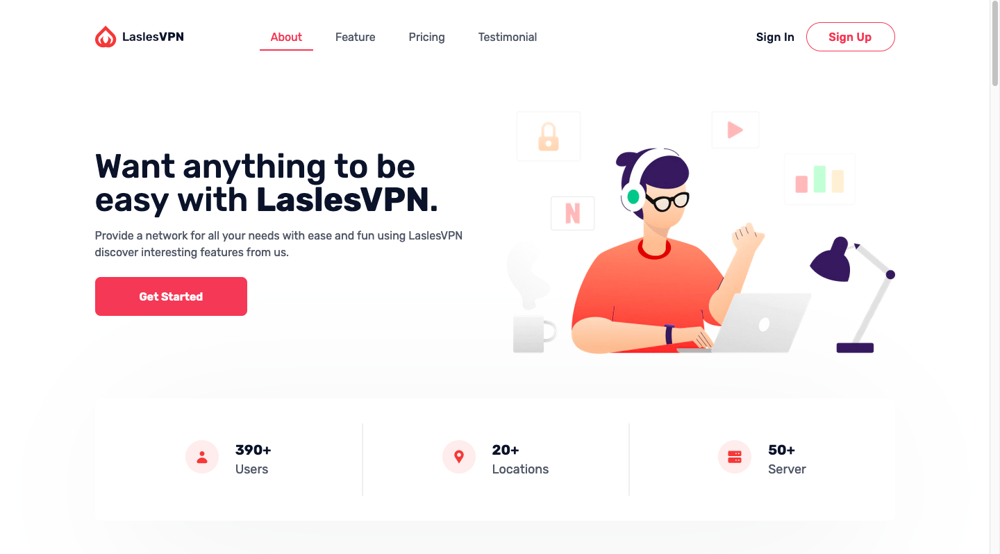

# [Tailwind VPN Landingpage](https://next-landing-vpn.vercel.app/) - Free Landingpage Template Apps

Tailwind VPN Landingpage is an open source, apps landing page template for [Tailwind CSS](https://tailwindcss.com/) and[ NextJS](nextjs.org/) coded by [Faldi](twitter.com/f2aldi) and design from [Didi](https://twitter.com/didiikurniawann).

## Getting Started

Choose one of the following options to get started:

- [Download the latest release](https://github.com/naufaldi/next-landing-vpn/archive/main.zip)
- Clone the repo: `git clone https://github.com/naufaldi/next-landing-vpn.git`
- Fork the repo

## About the Template

- Template building using NextJS Version 10
- Tailwind v2.0

## Feature Template

- Using [NextJS Image](https://nextjs.org/docs/api-reference/next/image) for Image Optimization
- Slider using [React Slick](https://react-slick.neostack.com/docs/api)
- Smooth Scrolling and Active menu using [React Scroll](https://www.npmjs.com/package/react-scroll)

## Bugs and Issues

Have a bug or an issue with this template? [Open a new issue](https://github.com/naufaldi/next-landing-vpn/issues/new) here on GitHub.

## Creator

[Tailwind VPN Landingpage](https://next-landing-vpn.vercel.app/) was coded and modified by and is maintained by **[me](https://github.com/naufaldi/)**, and dekstop design by [Didi Kurniawan](https://twitter.com/didiikurniawann)

## Copyright and License

Code released under the MIT license.

## To Do List Add Feature

- [ ] Animation using Framer Motion
